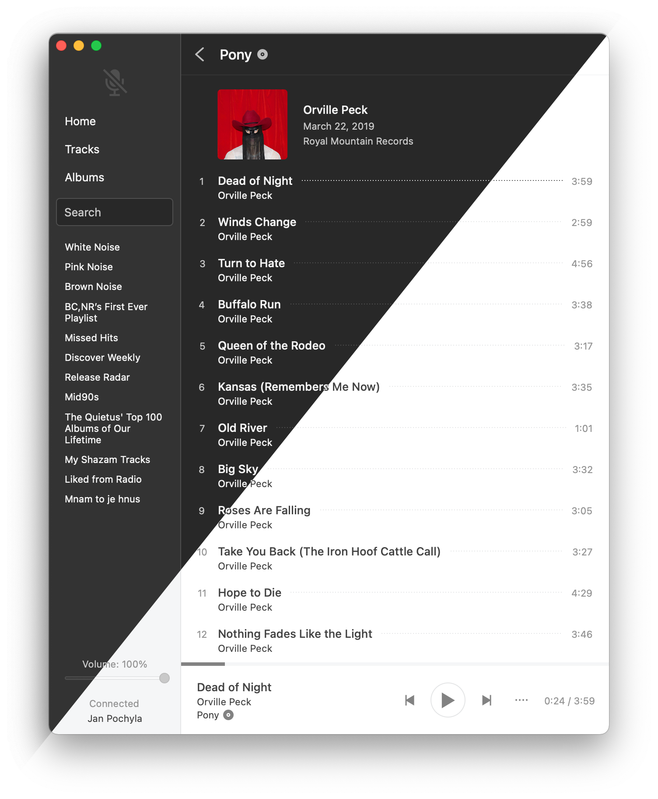

# Psst

Fast Spotify client with native GUI, without Electron, built in Rust. Very early in development, lacking in features, stability, and general user experience. It is being tested only on Mac so far, but aims for full Windows and Linux support. Contributions welcome!



##### Building

Development build:
```
$ git submodule update --recursive --init
$ cargo build
```

Release build:
```
$ git submodule update --recursive --init
$ cargo build --release
```

##### Running and configuration

```
$ cd psst-gui
$ cargo run
# Use cargo run --release for the release build.
```

##### Roadmap

- [x] Vorbis track playback
- [x] Browsing saved albums and tracks
- [x] Save / unsave albums and tracks
- [x] Browsing followed playlists
- [x] Search for artist, albums, and tracks
- [ ] Resilience to network errors
- [ ] Managing playlists
    - Follow / unfollow
    - Add / remove track
    - Reorder tracks
    - Rename playlist
- [ ] Playback queue
- [ ] Audio volume control
- [x] Audio loudness normalization
- [ ] React to audio output device events
    - Pause after disconnecting headphones
    - Transfer playback after connecting headphones
- [ ] Better caching
    - Cache as much as possibly of WebAPI responses
    - Visualize cache utilization
        - Total cache usage in the config dialog
        - Show time origin of cached data, allow to refresh
- [ ] Media keys control
- [ ] Open Spotify links
- [ ] Trivia on the artist page, Wikipedia links
- [ ] Genre playlists and "For You" content
- [ ] Downloading encrypted tracks
- [ ] Reporting played tracks to Spotify servers
- [ ] OS-specific application bundles
- [ ] Podcast support
- UI
    - [ ] Rethink current design, consider a two-pane layout
        - Left pane for browsing
        - Right pane for current playback
    - [x] Dark theme
    - [ ] Detect light/dark OS theme
    - [ ] Icon
    - [ ] Robust error states, ideally with retry button
    - [ ] Correct playback highlight
        - Highlight now-playing track only in the correct album / playlist
        - Keep highlighted track in viewport
    - [ ] Paging or virtualized lists for albums and tracks
    - [ ] Grid for albums and artists
    - [ ] Robust active/inactive menu visualization
    - [ ] Save last route and the last playback state

##### Development

Contributions are very welcome! Project structure:

- `/psst-cli` - Example CLI that plays a track.  Credentials need to be configured in the code.
- `/psst-core` - Core library, takes care of Spotify TCP session, audio file retrieval, decoding, audio output, playback queue, etc.
- `/psst-gui` - GUI application built with [Druid](https://github.com/linebender/druid)
- `/psst-protocol` - Internal Protobuf definitions used for Spotify communication.

##### Thanks

This project would not exist without:

- Big thank you to [`librespot`](https://github.com/librespot-org/librespot), the Open Source Spotify client library for Rust.  Most of `psst-core` is directly inspired by the ideas and code of `librespot`, although with a few differences:
    - Spotify Connect (remote control) is not supported yet.
    - We're completely synchronous, without `tokio` or other `async` runtime.  I just don't understand the `async` jungle enough to port `librespot` from pre-async/await `tokio-0.1` code to anything both stable and modern.
    - We're using HTTPS-based CDN audio file retrieval, similar to the official Web client or [`librespot-java`](https://github.com/librespot-org/librespot-java), instead of the older, channel-based approach in `librespot`.
- [`druid`](https://github.com/linebender/druid) native GUI library for Rust.
- [`aspotify`](https://github.com/KaiJewson/aspotify) asynchronous client library for the Spotify Web API.
- [`ncspot`](https://github.com/hrkfdn/ncspot) cross-platform ncurses Spotify client written in Rust, using `librespot`.
